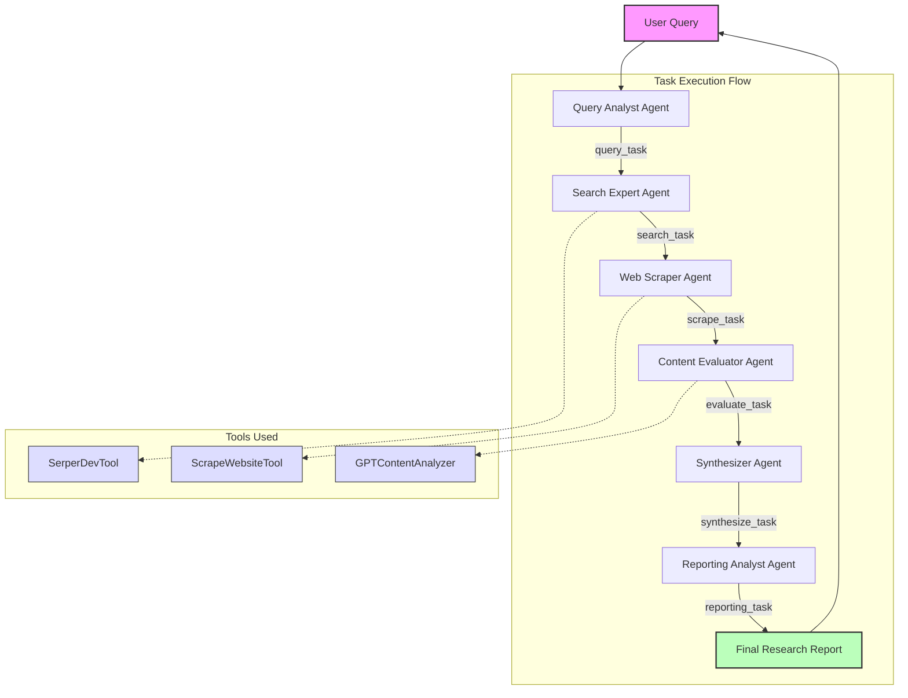

# Web Research Agent Documentation

## Project Overview

The Web Research Agent is an automated digital research assistant built using the CrewAI framework. It leverages AI agents to search the web, extract information, analyze content, and generate comprehensive research reports based on user queries with minimal human input. This system uses multiple specialized agents working in sequence, each focused on a specific aspect of the research process.

## Architecture Diagram



## Step-by-Step Decision Making Process

The Web Research Agent follows a structured decision-making process:

1. **Query Analysis**
   - The Query Analyst Agent analyzes the user's query
   - Identifies key concepts, topics, and subtopics
   - Determines research scope and boundaries
   - Formulates specific questions that need answers
   - Creates a structured research plan with priorities

2. **Search Strategy Determination**
   - The Search Expert Agent formulates effective search queries based on the analysis
   - Determines which search terms will yield the most relevant results
   - Decides which types of sources to prioritize (e.g., academic, news, general)
   - Executes searches and evaluates result relevance

3. **Source Selection**
   - Evaluates search results based on relevance and authority
   - Prioritizes sources by credibility, recency, and relevance
   - Selects a diverse set of sources to cover different perspectives
   - Returns a ranked list of URLs for scraping

4. **Content Extraction**
   - The Web Scraper Agent determines how to navigate to each URL
   - Identifies which content elements are relevant to the query
   - Extracts main content while filtering out advertisements and irrelevant material
   - Structures the extracted content for further analysis

5. **Content Evaluation**
   - The Content Evaluator Agent assesses each piece of content against the original query
   - Evaluates reliability of sources using predefined criteria
   - Identifies key insights and findings
   - Detects potential biases or contradictions
   - Assigns relevance and credibility scores

6. **Information Synthesis**
   - The Synthesizer Agent organizes information by topic and subtopic
   - Identifies patterns, trends, and consensus across sources
   - Resolves contradictions by weighing source credibility
   - Prioritizes information based on relevance and reliability
   - Creates a coherent narrative that addresses the original query

7. **Report Generation**
   - The Reporting Analyst Agent determines the most effective report structure
   - Selects which information to highlight and which to include as supporting details
   - Formats content according to best practices for readability
   - Ensures the report directly answers all aspects of the original query
   - Includes source citations and quality assessments

## Error Handling and Problem Management

### Unreachable Websites
1. **Detection**: The Web Scraper Agent identifies when a website is unreachable
2. **Logging**: Records the failure and specific error (e.g., timeout, 404, access denied)
3. **Adaptive Search**: If multiple sites are unreachable, the agent triggers a secondary search for additional sources
4. **Reporting**: Includes information about unreachable sources in the final report for transparency

### Conflicting Information
1. **Identification**: The Content Evaluator and Synthesizer Agents flag contradictory information
2. **Source Assessment**: Evaluates the credibility of conflicting sources
3. **Resolution Strategy**:
   - Presents the most credible interpretation based on source quality
   - When sources are equally credible, presents both perspectives
   - Notes the existence of contradictions in the report
   - Provides context about why contradictions might exist
4. **Additional Research**: For critical contradictions, may trigger targeted additional searches

### Poor Quality or Irrelevant Results
1. **Quality Threshold**: Content with low relevance or credibility scores is flagged
2. **Scope Adjustment**: May narrow or broaden search scope based on result quality
3. **Transparency**: Clearly indicates in the report when information quality is suboptimal

### Technical Failures
1. **API Failures**: If search or other APIs fail, implements exponential backoff retry strategy
2. **Timeout Management**: Sets appropriate timeouts for each operation with fallback behaviors
3. **Graceful Degradation**: Can operate with reduced functionality if certain components fail


## Tools: Input, Output, and Decision Flow

### SerperDevTool

**Input:**
- Search queries formulated by the Search Expert Agent
- Optional parameters:
  - Result type (web, news, images)
  - Number of results to return

**Output:**
- Structured search results containing:
  - URLs of relevant web pages
  - Page titles
  - Brief snippets/descriptions
  - Source domains
  - Publication dates (for news results)

**Decision Process:**
1. The Search Expert Agent formulates search queries based on the Query Analyst's plan
2. Search results are received and evaluated for relevance
3. The agent ranks results based on:
   - Relevance to specific research questions
   - Source authority and diversity
   - Information freshness
4. The agent selects the most promising URLs for scraping
5. If results are insufficient, the agent reformulates queries and repeats

### ScrapeWebsiteTool

**Input:**
- URLs selected by the Search Expert Agent
- Content types to extract (text, tables, lists)

**Output:**
- Structured content from each website:
  - Main text content
  - Relevant metadata (publication date, author)
  - Page structure information
  - Error information for failed scrapes

**Decision Process:**
1. The Web Scraper Agent determines the appropriate scraping strategy for each URL
2. Content is extracted according to relevance heuristics
3. The agent structures and normalizes the extracted content
4. For each site, the agent decides:
   - Which content elements to preserve
   - How to structure the output for analysis
5. Failed scrapes trigger appropriate fallback strategies

### GPTContentAnalyzer

**Input:**
- User's original research query
- Content extracted by the Web Scraper Agent


**Output:**
- Structured content analysis:
  - Relevance score (High, Medium, Low)
  - Credibility score (High, Medium, Low)
  - Key insights in bullet point format
  - Potential bias or reliability issues
  - Relationship to specific research questions

**Decision Process:**
1. The Content Evaluator Agent submits content to the analyzer
2. Analysis results are evaluated against minimum quality thresholds
3. The agent decides:
   - Whether to include or exclude specific content
   - How to weight information in the synthesis
   - If additional sources are needed for specific topics
4. High-value insights are flagged for priority inclusion in the synthesis
5. Problematic content is appropriately contextualized or excluded

## Agent System: Detailed Structure

### Query Analyst Agent

**Purpose**: Analyzes and breaks down the user's query into structured components

**Prompt Design**:
- The prompt instructs the agent to think like an expert research strategist
- It emphasizes identifying explicit and implicit information needs
- It directs the agent to create a comprehensive research plan
- Key instructions include:
  - Breaking down complex queries into component questions
  - Identifying key entities and relationships
  - Determining appropriate scope and depth
  - Establishing clear success criteria for the research

**Decision Making**:
- Uses semantic analysis to understand query intent
- Prioritizes research aspects based on likely importance
- Structures the research plan in logical sequence
- Identifies potential knowledge gaps that require specific attention

**Implementation**: Defined in `agents_config['query_analyst']`

### Search Expert Agent

**Purpose**: Searches the web for relevant information based on the structured query

**Prompt Design**:
- The prompt creates the persona of an expert web researcher
- It emphasizes strategic search formulation techniques
- It includes instructions for:
  - Translating research questions into effective search queries
  - Recognizing high-value information sources
  - Evaluating search result relevance
  - Ensuring comprehensive coverage of all research aspects

**Tool Integration**:
- Uses SerperDevTool to execute searches
- Passes carefully formulated search queries
- Processes returned results to select optimal sources

**Error Handling**:
- Detects when searches return insufficient results
- Reformulates queries using alternative terminology
- Broadens search scope when necessary
- Falls back to more general sources when specialized ones are unavailable

**Implementation**: Defined in `agents_config['search_expert']`

### Web Scraper Agent

**Purpose**: Extracts content from websites identified by the Search Expert

**Prompt Design**:
- The prompt establishes the agent as an expert in web content extraction
- It emphasizes identifying and extracting the most relevant content
- It includes instructions for:
  - Recognizing valuable content structures (articles, data tables, lists)
  - Filtering out advertisements and irrelevant material
  - Preserving important context and metadata
  - Handling different website layouts effectively

**Tool Integration**:
- Uses ScrapeWebsiteTool to navigate to URLs and extract content
- Processes raw HTML to extract meaningful text
- Structures extracted content for further analysis

**Error Handling**:
- Detects various scraping errors (access denied, timeouts)
- Attempts alternative access methods when direct access fails
- Records and reports scraping failures
- Prioritizes successfully scraped content when some sources fail

**Implementation**: Defined in `agents_config['web_scraper']`

### Content Evaluator Agent

**Purpose**: Assesses the quality and relevance of scraped content

**Prompt Design**:
- The prompt creates the persona of an expert content analyst
- It emphasizes critical evaluation of information quality
- It includes specific criteria for:
  - Assessing relevance to the original query
  - Evaluating source credibility and authority
  - Identifying potential bias or misleading information
  - Extracting key insights even from imperfect sources

**Tool Integration**:
- Uses GPTContentAnalyzer to perform deep content analysis
- Processes analysis results to make inclusion decisions
- Generates structured evaluation data for the synthesis phase

**Error Handling**:
- Manages cases where content quality is universally low
- Adjusts quality thresholds based on available information
- Flags potentially problematic information for special handling
- Balances the need for information with quality concerns

**Implementation**: Defined in `agents_config['content_evaluator']`

### Synthesizer Agent

**Purpose**: Combines and organizes the analyzed information

**Prompt Design**:
- The prompt establishes the agent as an expert in information synthesis
- It emphasizes creating coherent narratives from diverse sources
- It includes instructions for:
  - Organizing information by topic and subtopic
  - Resolving contradictions between sources
  - Weighting information by source quality
  - Creating a comprehensive yet focused synthesis

**Decision Making**:
- Structures information according to the research plan
- Resolves conflicts by comparing source credibility
- Identifies consensus views and notable disagreements
- Creates logical flow between interconnected topics

**Error Handling**:
- Manages incomplete information by acknowledging gaps
- Handles contradictory information by presenting balanced views
- Deals with information overload through effective prioritization
- Adapts synthesis structure when information doesn't fit the expected pattern

**Implementation**: Defined in `agents_config['synthesizer']`

### Reporting Analyst Agent

**Purpose**: Creates the final comprehensive research report

**Prompt Design**:
- The prompt creates the persona of an expert report writer
- It emphasizes clarity, structure, and comprehensive coverage
- It includes instructions for:
  - Creating effective executive summaries
  - Structuring information for maximum readability
  - Including appropriate citations and references
  - Ensuring the report directly answers the original query

**Decision Making**:
- Determines optimal report structure based on content
- Chooses appropriate formatting for different types of information
- Selects which details to highlight and which to include as supporting information
- Ensures consistent style and terminology throughout

**Error Handling**:
- Adapts report structure when information is incomplete
- Explicitly acknowledges limitations in the research
- Includes appropriate caveats for less reliable information
- Suggests areas for future research when questions cannot be fully answered

**Implementation**: Defined in `agents_config['reporting_analyst']`

## Task Flow
The system uses a sequential process where tasks are executed in order:

1. **Query Task** (`query_task`):
   - Analyzes the user's research query
   - Produces a structured research plan

2. **Search Task** (`search_task`):
   - Searches the web for relevant information
   - Returns a list of promising URLs

3. **Scrape Task** (`scrape_task`):
   - Extracts content from the identified websites
   - Returns structured text data

4. **Evaluate Task** (`evaluate_task`):
   - Analyzes the scraped content for relevance and quality
   - Provides evaluation metrics and key insights

5. **Synthesize Task** (`synthesize_task`):
   - Combines information from multiple sources
   - Creates a coherent narrative addressing the query

6. **Reporting Task** (`reporting_task`):
   - Formats the synthesized information into a comprehensive report
   - Ensures the report is clear, well-structured, and addresses the original query


## Streamlit Integration

The Web Research Agent is implemented as a Streamlit application that provides:

1. **User Interface Components**:
	- password input for entering OpenAI and Serper API keys
   - Text input for entering research queries
   - Submit button to initiate the research process
   - Progress indicators showing current agent activity
   - Formatted display of the final research report

2. **Error Handling Interface**:
   - Displays user-friendly error messages
   - Shows diagnostic information when needed

3. **Result Presentation**:
   - Renders the final report in formatted markdown
   - Includes source citations and quality indicators

## Configuration and Customization

### Configuration Files

The system uses YAML configuration files to define agent and task parameters:

1. **agents.yaml**:
```yaml
query_analyst:
  role: "Expert Research Strategist"
  goal: "Analyze user queries and create structured research plans"
  backstory: "You are an expert at breaking down complex questions into researchable components..."
  verbose: true
  # Additional parameters...

search_expert:
  # Similar configuration structure...

# Additional agent configurations...
```

2. **tasks.yaml**:
```yaml
query_task:
  description: "Analyze the user's query and create a structured research plan"
  expected_output: "A detailed research plan with key questions and search strategies"
  agent: "query_analyst"
  # Additional parameters...

search_task:
  # Similar configuration structure...

# Additional task configurations...
```

### Prompt Design Principles

The system's prompts are designed following these principles:

1. **Role-Based Instructions**:
   - Each agent has a clear role identity
   - Prompts establish the agent as an expert in its domain
   - Instructions align with the specific expertise of each role

2. **Goal Orientation**:
   - Clear objectives are specified for each agent
   - Success criteria are explicitly defined
   - Agents understand how their output will be used

3. **Structured Reasoning**:
   - Prompts encourage step-by-step analysis
   - Agents are guided to consider multiple perspectives
   - Decision criteria are explicitly provided

4. **Error Awareness**:
   - Agents are instructed on how to handle common problems
   - Fallback strategies are included in prompts
   - Quality thresholds guide decision making

### External Tool Integration

The system connects to external tools through:

1. **API-Based Integration**:
   - SerperDevTool connects to the Serper.dev API
   - API calls are managed with appropriate error handling
   - Rate limiting and quota management are implemented

2. **Tool Wrappers**:
   - Each external tool is wrapped in a consistent interface
   - Tool inputs and outputs are standardized
   - Error handling is centralized

3. **Information Flow**:
   - Tools receive structured inputs from agents
   - Tool outputs are processed before being passed to subsequent agents


4. **Fallback Mechanisms**:

   - Cached results can be used when live data is unavailable


## Error Handling 

### Error Detection

1. **Input Validation**:
   - User queries are validated for minimum length and clarity
   - Invalid inputs trigger appropriate error messages
   - Users are guided to provide more specific queries when needed

2. **API Error Detection**:
   - HTTP error codes are monitored and interpreted
   - Timeouts are detected and managed
   - Rate limit errors trigger appropriate throttling

3. **Content Quality Assessment**:
   - Low-quality results are flagged by content evaluation
   - Off-topic content is detected and filtered
   - Incomplete information scenarios are identified


## Conclusion

The Web Research Agent represents a powerful synthesis of AI agents, external tools, and structured workflows to automate the research process. By breaking down complex research tasks into specialized components handled by expert agents, the system can efficiently gather, analyze, and synthesize information into comprehensive research reports. The agent's robust error handling and decision-making capabilities ensure reliable operation even in challenging scenarios, making it a valuable tool for researchers, analysts, students, and professionals who need to quickly gather and process information from across the web.
